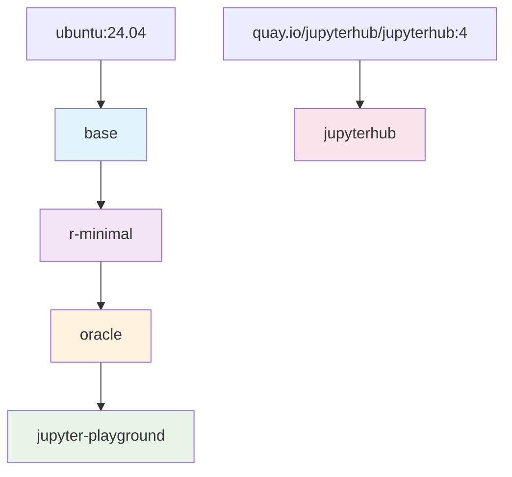

# Docker Images CI Pipeline

This repository contains a multi-stage Docker build pipeline for data science and JupyterHub images, inspired by best practices from [dapla-lab-images](https://github.com/statisticsnorway/dapla-lab-images) and [Insee's datascience images](https://github.com/InseeFrLab/images-datascience).

## 🏗️ Image Architecture

The images are built in a dependency chain, where each image extends the previous one:

### Image Descriptions

| Image | Description | Base | Key Components |
|-------|-------------|------|----------------|
| **base** | Foundation image with common tools | `ubuntu:24.04` | Git, curl, wget, locale setup, user management |
| **r-minimal** | R environment with essential packages | `base` | R 4.4.0, Java 17, rocker scripts, SSB R packages |
| **oracle** | Oracle database connectivity | `r-minimal` | Oracle Instant Client 21c, SQL*Plus, TNS configuration |
| **jupyter-playground** | Full data science stack | `oracle` | JupyterLab, Python 3.11, Conda, data science packages |
| **jupyterhub** | JupyterHub server (independent) | `quay.io/jupyterhub/jupyterhub:4` | DockerSpawner, authentication tools |

## 🚀 CI/CD Workflows

### Main Pipeline: `docker-build-pipeline.yml`

**Triggers:**
- Push to `main` branch (when `docker/**` or workflow files change)
- Pull requests to `main`
- Release published
- Manual dispatch

**Build Order:**
1. `base` (parallel with `jupyterhub`)
2. `r-minimal` (depends on `base`)
3. `oracle` (depends on `r-minimal`)
4. `jupyter-playground` (depends on `oracle`)
5. `jupyterhub` (independent, runs in parallel)

## 🧪 Testing

Each image is validated with smoke tests during the CI pipeline:

- **base**: Basic shell functionality
- **r-minimal**: R installation and version check
- **oracle**: Oracle client availability
- **jupyter-playground**: Jupyter and Python functionality
- **jupyterhub**: JupyterHub version check

Tests run automatically after each image build to ensure functionality before pushing to registry.

## 📦 Registry and Tagging

**Registry:** `europe-north1-docker.pkg.dev/artifact-registry-5n/itinfra-bakkesyst-docker/jupyter-onprem-2025` (Google Artifact Registry)

**Tagging Strategy:**
- `latest` - Latest successful build from main branch push
- `{tag}-{sha}` - Release tag and commit SHA (e.g., `v1.0.0-abc1234`) - **only on release publish**
- `{branch}` - Branch reference for PRs
- `{pr}` - Pull request number

**Event-based Tagging:**
- **Push to main** → `latest` tag
- **Release published** → `{tag}-{sha}` tag (e.g., `v1.0.0-abc1234`)
- **Pull request** → `pr-{number}` tag
- **Push to branch** → `{branch}` tag

## ⚙️ Configuration

### Environment Variables

Configure via GitHub repository secrets:

- `GAR_PROJECT_NUMBER` - Google Cloud project number for workload identity authentication

### Secrets

Required secrets:
- `GAR_PROJECT_NUMBER` - Google Cloud project number for workload identity authentication

## 🔍 Monitoring and Troubleshooting

### Build Status

- Check the **Actions** tab for build status
- Each workflow provides detailed summaries
- Failed builds include logs and error details

### Common Issues

1. **Base image dependency failures**: Ensure parent images are built first
2. **Registry authentication**: Verify Google Cloud workload identity setup
3. **Resource limits**: Large images may need more runner resources

### Debugging

Check the **Actions** tab in GitHub for detailed build logs and error information. Each workflow step provides comprehensive output for troubleshooting.

## 📋 Best Practices

Based on learnings from dapla-lab-images and Insee datascience repositories:

1. **Dependency Management**: Clear build order with proper dependencies
2. **Parameterized Builds**: ARG-based base images for flexibility
3. **Caching Strategy**: Efficient layer caching to speed up builds
4. **Security**: Regular base image updates and vulnerability scanning
5. **Documentation**: Clear documentation of image contents and usage

## 🤝 Contributing

1. Modify Dockerfiles in `docker/{image}/`
2. Create PR - CI will build and test automatically
3. After merge to main, images are automatically built and pushed

## 📚 References

- [dapla-lab-images](https://github.com/statisticsnorway/dapla-lab-images) - Primary inspiration
- [Insee datascience images](https://github.com/InseeFrLab/images-datascience) - Additional patterns

- [Docker Build Push Action](https://github.com/docker/build-push-action) - GitHub Action used